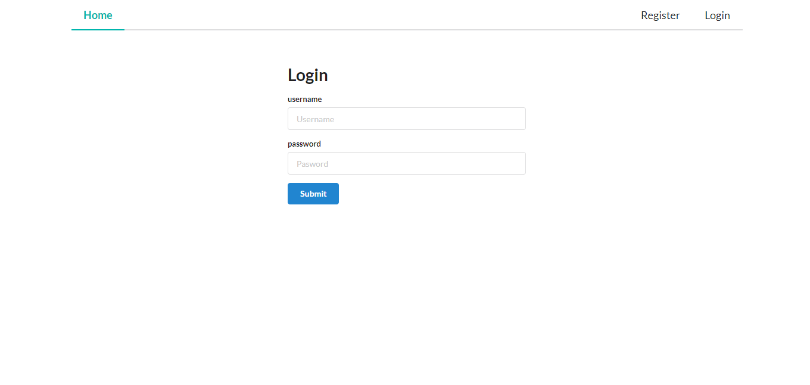
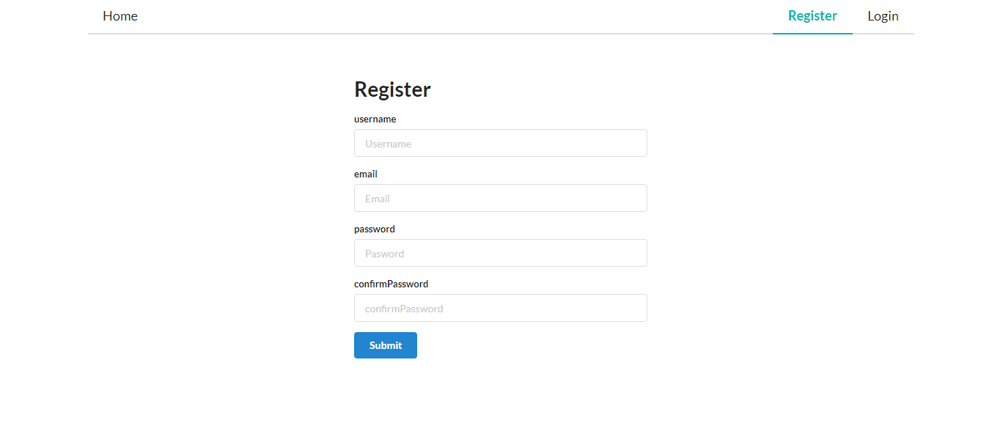
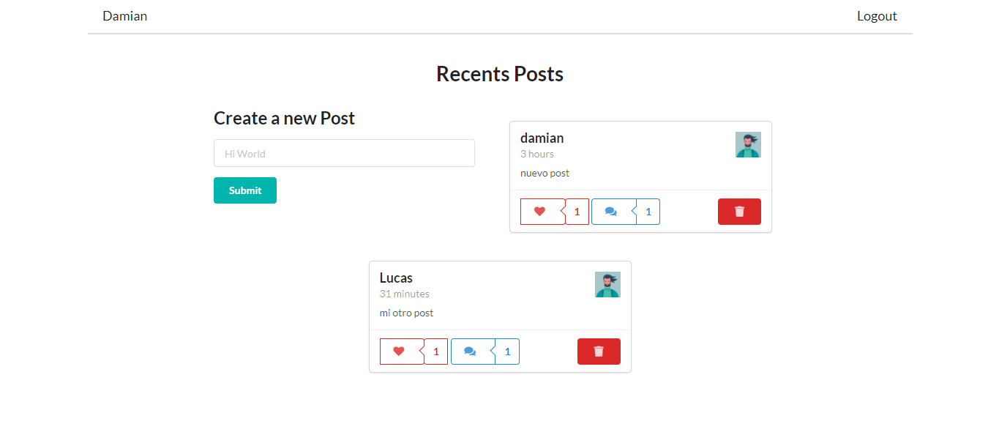
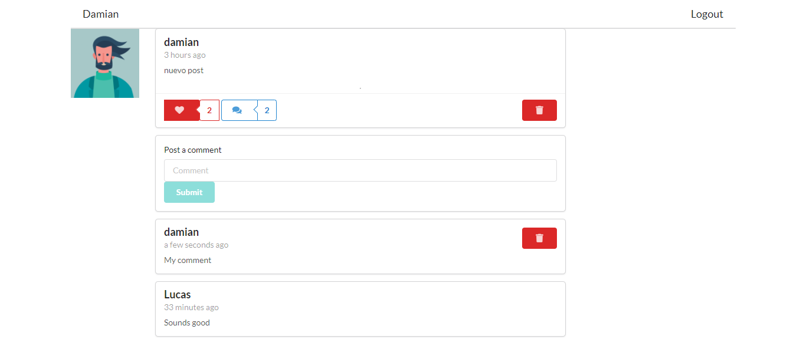

 # Social Media Project: 
### ReactJS, Semantic UI React,  ApolloCliente

Through the app you can create your own profile, create, like and comment Posts
You can find the Back in https://github.com/gomezlucas/merng-server-SocialMedia

To Test: 
User: damian@email.com
password: 123456

### Screens:

#### Login 
 

#### Register 
 

#### Home 
 

#### Single Post 
 

